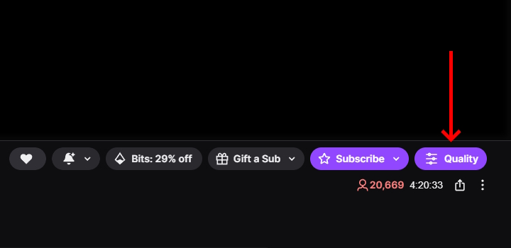
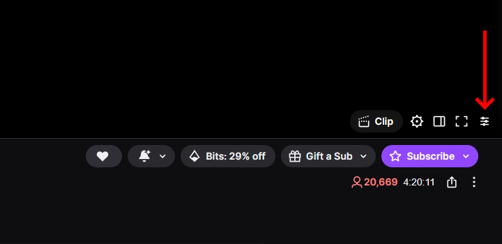

<h1 align="center">
Twitch - Toggle Video Quality
</h1>

Userscript that adds a configurable button to Twitch for quickly switching stream quality between the **lowest available** (with optional automatic muting) and a **preferred resolution** (e.g., 1080p).

Designed for users who want fast quality control without opening the player settings menu.

## ✨ Features

- Toggle between **lowest available quality** and your **preferred resolution**.
- Automatically falls back to the highest available resolution if the preferred one is not present.
- Optional **auto-mute when switching to lowest quality**.
- Optional **persistent selection** (quality and mute status survive page reload).
- Two UI modes:
  - **Minimal** -- small `Q` button inside player controls.
  - **Header** -- purple "Quality" button in the channel header (next to "Subscribe").
- Uses Twitch's internal player API (no UI clicking).
- Fully client-side. No external dependencies.

## 🖼 Screenshots

### Header button



### Minimal button



## 🚀 Installation

1. Install [Tampermonkey](https://www.tampermonkey.net/) (or another userscript manager).
2. Install the script from one of the mirrors:
   - [GreasyFork](https://greasyfork.org/en/scripts/...)
   - [OpenUserJS](https://openuserjs.org/scripts/Vikindor/...)
   - Or [install directly from this repository](./Twitch_-_Toggle_Video_Quality.js).

## 🔧 Configuration

Inside the script:

``` js
const PREFERRED_HIGH = 1080;      // Preferred resolution (e.g., 1080). Falls back if unavailable.
const MUTE_ON_LOW = true;         // Automatically mute when switching to lowest quality.
const PERSIST_SELECTION = true;   // Persist quality + mute across page reload.
const VISUAL_MODE = 'header';     // 'minimal' or 'header'
```

## ⚙ How it works (High-Level)

-   Accesses Twitch's internal React player instance.
-   Uses native methods:
    -   `setQuality()`
    -   `getQualities()`
    -   `setMuted()`
-   Selects lowest quality by bitrate.
-   Selects preferred resolution by matching height (e.g., 1080).
-   Synchronizes state with Twitch's own `localStorage` keys:
    -   `video-quality`
    -   `video-muted`
-   Restores mute state after player initialization.

No UI automation. No simulated clicks.
